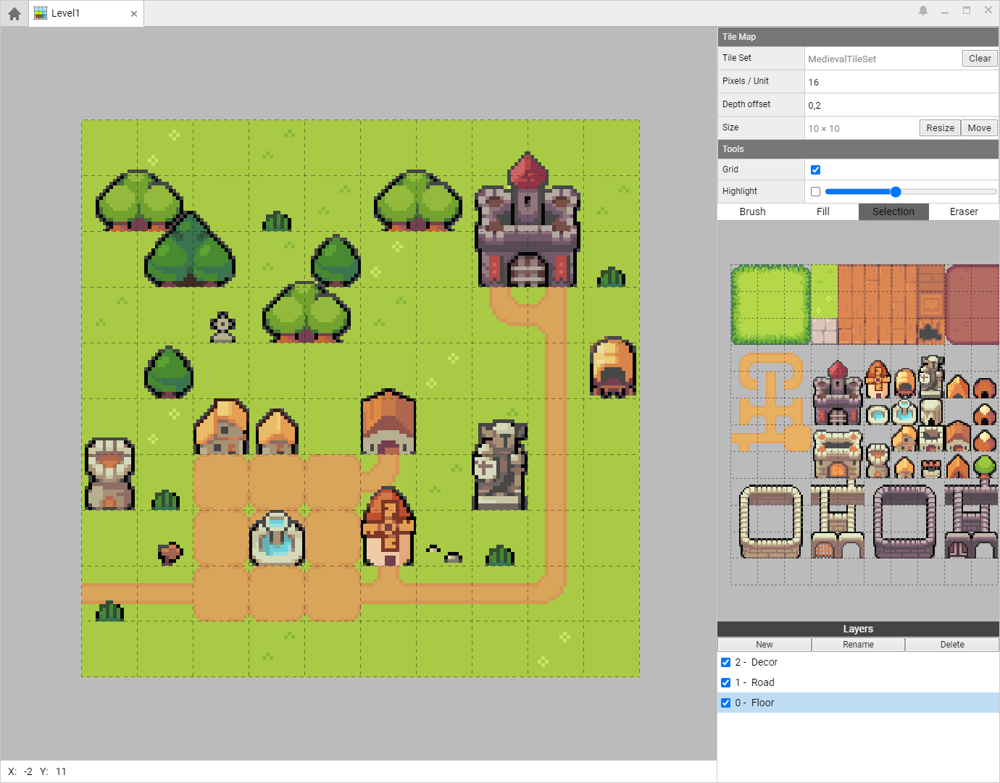

# Éditeur de tilemap

L'éditeur de tilemap vous permet de concevoir des niveaux à partir de tuile issu d'une tileset.



## Contrôles

Utilisez le **clic gauche** pour placer une tuile et **clic droit** pour selectionner une tuile depuis le calque actif.

Utilisez le **clic molette** pour déplacer la vue. Alternativement, vous pouvez utiliser **Alt + clic gauche**.

Utilisez la **molette** ou **+/-** pour zoomer.

## Raccourcis claviers

L'éditeur de tilemap possède des raccourcis clavier pour vous aidez à construire vos niveaux plus rapidement.

Utilisez **I** pour activer le mode isolation et **G** pour afficher la grille.

Avec l'outil pinceau, activé avec **B**:
 * Utilisez **H/V** pour renverser les tuiles horizontalement ou verticalement
 * Utilisez **R** pour tourner les tuiles
 * Si une seule tuile est sélectionné vous pouvez utilisez la touche **Shift** pour faire des lignes droites

With the selection tool, activated with **S**:
 * Use **M** to move your selection
 * Use **D** to duplicate your selection
 * Use **CTRL+A** to select the whole layer

Utilisez **E** to switch to the eraser tool and **F** to activate the flood fill tool.

```
// Test
Sup.Audio.playSound("My Sound Asset");
```

| Tables        | Are           | Cool  |
| ------------- |:-------------:| -----:|
| col 3 is      | right-aligned | $1600 |
| col 2 is      | centered      |   $12 |
| zebra stripes | are neat      |    $1 |
